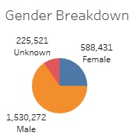

# NYC CitiBike Challenge UofT bootcamp Module 10

## Overview
### Purpose

The purpose of this analysis is to provide insight to the client who is interested in starting a bike share in their home city. This analysis uses data from the CitiBike NYC bikeshare program from August 2019. It is focused on the effects of gender on usage of the bikeshare program.

## Results
The results are summarized in the following 8 visualizations generated in Tableau. This the link to the [Tableau Story File](https://public.tableau.com/app/profile/albert1316/viz/NYCCitibikeanalysis_16601592320290/AnalysisofCitibikeNYC082019)

  
A breakdown of the reported gender of the user for the month of August 2019.

  
Length of time of each trip in the month of August 2019.

  
Length of time of each trip broken down by gender.

  
Amount of trips per hour of the day. The busiest time is between 5pm and 7pm.

  
Heatmap of trips by weekday per hour. This shows which day between 5pm and 7pm is the busiest.

  
Heatmap of trips by weekday per hour by gender. This shows any gender bias in usage times.

  
A breakdown of Subscribers to Customers

  
Breakdown by gender of which user type is using the service at which hour of the day.

## Summary

This analysis could be used to compare target market demographics between New York and the proposed city. It could also be used to guide the positioning of bikes in the proposed city. In addition, the results show that in general more males users ride for longer. This could be used in marketing strategies. This analysis is limited to comparision by gender primarily. More data could be gathered on the users of the NYC system such as reasons for trips and location data. With more data it can help explain why the system is being used.  
